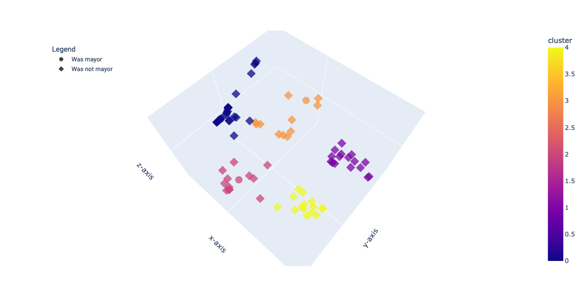

# Toronto City Council Clustering
Cluster Toronto city councillors by how they vote on municipal items.

Data obtained from City of Toronto's [Open Data](https://open.toronto.ca/dataset/members-of-toroxnto-city-council-voting-record/).



**Deployed at https://toronto.klogg.blog/.**


## Development Setup
Set up a virtual environment and install requirements:
```sh
mkdir .venv
python -m venv .venv
source ./.venv/bin/activate
pip install --upgrade pip wheel
pip install -r webapp/requirements.txt
```

Install [gcloud](https://cloud.google.com/sdk/docs/install).


## Updating Data
Currently, the way to update data is to manually download the CSVs from [Toronto Open Data](https://open.toronto.ca/dataset/members-of-toronto-city-council-voting-record/) to the `./data` folder. Then run the Jupyter Notebook `cluster_councillors.ipynb` to generate the required dataframe for plotting.


## Ideas
- Make legend easier to parse
- Highlight by person (dropdown?)
- Filter by agenda topic (policing etc) (hard?)
- Add social icons
- Review explanation
- Add 'yes', 'no' and 'absent' votes to hover text
- Use hovertemplate and annotations to customize hover text? https://github.com/plotly/dash-sample-apps/blob/main/apps/dash-clinical-analytics/app.py#L180
- Try making N/A votes the average of a given councillor's other non-N/A votes (see John Tory and Olivia Chow in 2023)
- Layout for mobile
